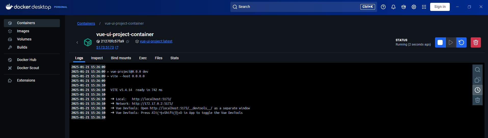

# vue-project

This template should help get you started developing with Vue 3 in Vite.

## Recommended IDE Setup

[VSCode](https://code.visualstudio.com/) + [Volar](https://marketplace.visualstudio.com/items?itemName=Vue.volar) (and disable Vetur).

## Customize configuration

See [Vite Configuration Reference](https://vite.dev/config/).

## Project Setup

```sh
npm install
```

### Compile and Hot-Reload for Development

```sh
npm run dev
```

### Compile and Minify for Production

```sh
npm run build
```

### Run Unit Tests with [Vitest](https://vitest.dev/)

```sh
npm run test:unit
```

### Lint with [ESLint](https://eslint.org/)

```sh
npm run lint
```

# Docker Deployment (Local)

A script has been created 'docker-deploy-local.sh' at the root of this project that will be used to deploy a docker container locally of this application.

```sh
./docker-deploy-local.sh
```

Upon success, you should see a container deployed like the following:



You should then be able to use the following URL to connect to the application: http://localhost:5173/
